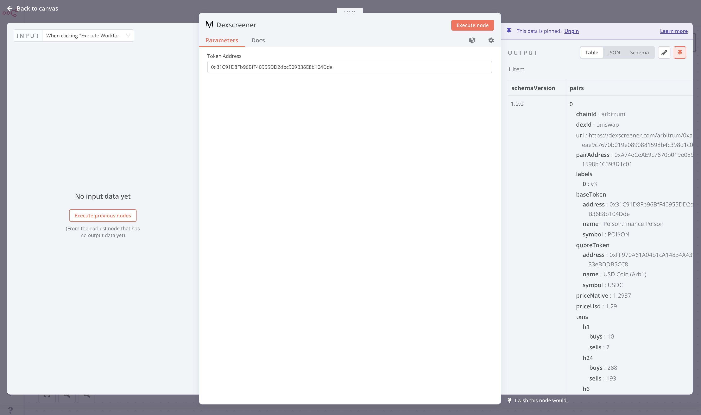

# n8n-nodes-dexscreener

Input the token address, the nodes will output the token information from Dexscreener. Dexscreeneer will automatically choose the right token for you.

You can install the community package on the n8n Web GUI, Settings -> Community nodes -> Install a community node, type "n8n-nodes-dexscreener" in the input box.

You can find deailted installation guide at [n8n website](https://docs.n8n.io/integrations/community-nodes/installation/#install-a-community-node).
